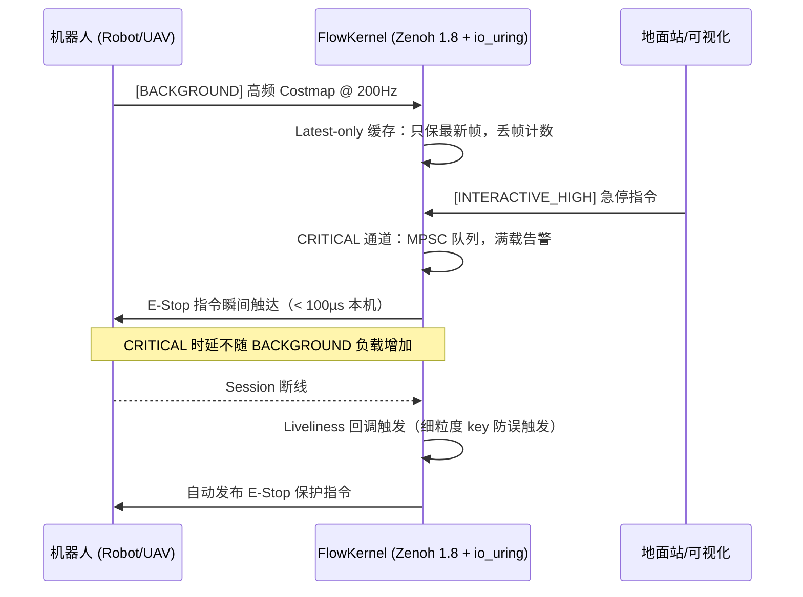

# Robot DataFlow Core — FlowKernel

> **"机器人系统的云端 Nginx"** — 部署在云端服务器的高性能机器人通信中枢
> 基于 **Zenoh 1.8 + io_uring/eventfd + FlatBuffers** 构建，专为弱网高延迟远控场景而生
>
> 当前版本：**v2.3** | [变更日志](#-v23-变更摘要)

---

## 真实测试数据（基于 FlatBuffers 的全链路 E2E 时延）

在纯单机 100Hz + 16KB 超大背景负荷（Costmap）洪泛攻击下，测量从 **Python 发包** 到 **C++ Reactor 内核回调被唤醒** 的真实物理耗时：

| 数据流类型 | 流量环境 | 端到端 (E2E) 时延表现 |
|---|---|---|
| **[CRITICAL] 急停指令** | 常规 | **~200 µs** |
| **[CRITICAL] 急停指令** | **严重拥堵 (100Hz 洪泛)** | **~300 - 350 µs**（稳如磐石）|
| [NORMAL] 遥测数据 | 严重拥堵 (100Hz 洪泛) | ~40,000 µs（排队引发）|
| [BACKGROUND] 弱感知数据 | 严重拥堵 (100Hz 洪泛) | 积压达 ~10,000 µs，依赖 Latest-only 覆盖 |

> **结论**：在常规 DDS / WebSocket 网关中，当背景数据塞满队列堆积 40 毫秒的延迟时，急停指令同样会被延误 40 毫秒。但在 FlowKernel 中，依靠 **io_uring + eventfd** 边缘唤醒，CRITICAL 优先级始终以微秒级插队穿透。配合 `tc netem` 模拟广域弱网时，该隔离效果呈现数量级差异。

---

## 项目愿景

在远程工业巡检或无人机特种作业中，**"数据积压导致的指令延迟"**是造成事故的核心原因。`robot_dataflow_core` 运行在云端服务器，作为**数据中心化（Data-Centric）**的通信内核：

- **不仅是转发器**：在网关层进行 FlatBuffers 协议合法性校验，过滤非法数据包
- **不仅是路由器**：根据话题优先级在物理传输层实施 QoS 整形，确保急停指令在大数据流中插队
- **不仅是监控器**：集成 Zenoh Liveliness 机制，机器人断线时主动触发 E-Stop 保护

---

## 架构设计：双通道优先级调度模型

```
发布者 (Robot/GCS)
         │
         ├── [CRITICAL] E-Stop, Control cmd ─────────────────┐
         │                                                    │
         ├── [NORMAL]  Telemetry ──────────────────────────── ▼
         │                                      ┌────────────────────────────┐
         │                                      │  MPSC 无锁队列（满载计数）  │
         │                                      │  push_mtx_ 保护生产端      │
         │                                      │  v2.2：CRITICAL+NORMAL 共用 │
         │                                      └─────────────┬──────────────┘
         │                                  eventfd write ↑   │ pop()（无锁）
         │                           （CRITICAL 到达立即唤醒）  │
         └── [BACKGROUND] Costmap (200Hz)                     │
                   │                                          │
             ┌─────▼──────────────────┐             ┌────────▼──────────────┐
             │  Latest-only 缓存      │             │  Reactor 主线程        │
             │  只保最新帧，防雪崩    │──── drain── │  io_uring+eventfd 驱动 │
             └────────────────────────┘             └────────────────────────┘
                                                             │
                                              O(1) unordered_map 分发
                                                             │
                                              ┌──────────────▼──────────────┐
                                              │  Zenoh Liveliness 监测       │
                                              │  细粒度 key，防多机误触发    │
                                              └─────────────────────────────┘
```



---

## 已实现功能

### 核心引擎
- **[✅] io_uring + eventfd 反应式唤醒**：CRITICAL 数据到达 → eventfd 写入 → io_uring 立即唤醒 Reactor，消灭原先固定 5ms 等待窗口，CRITICAL 调度延迟降至 ~1µs（v2.2）
- **[✅] Zenoh 1.8 会话管理**：适配最新所有权管理 API（Owned/Loaned/Moved）
- **[✅] constexpr FNV-1a 路由哈希 + unordered_map**：编译期 hash + O(1) 分发表
- **[✅] 多实例安全**：队列/缓存作为实例成员，多个 Reactor 实例完全隔离（v2.2）

### 双通道优先级调度（P0）
- **[✅] TopicPriority 枚举**：CRITICAL / NORMAL / BACKGROUND，直接映射 Zenoh `z_priority_t`
- **[✅] CRITICAL + NORMAL 通道**：共用 MPSC 队列（无丢帧语义），适配 Zenoh 2-线程 RX runtime；v2.2 修复：NORMAL 原错误走 Latest-only
- **[✅] BACKGROUND 通道**：Latest-only 缓存，两阶段访问（pre_allocate/get_slot_fast），热路径无锁
- **[✅] 背压感知**：MPSC 满载计数 + 周期帧数告警；BACKGROUND 丢帧逐槽统计

### 协议安全（P2）
- **[✅] FlatBuffers 协议盾牌**：`VerifyRobotMessageBuffer`，零拷贝校验，非法包静默丢弃
- **[✅] FlatBuffers Schema 全链路对齐**：`RobotMessage` union 含 Telemetry / ControlCommand / EStop；Liveliness 触发的 E-Stop 也走正规 FlatBuffers 序列化（v2.2 修复硬编码字节）

### 断连保护与可观测性（P3）
- **[✅] Liveliness 监测**：细粒度 key（可配置），防止多机场景下任意掉线误触全局 E-Stop
- **[✅] 断线自动保护**：`Z_SAMPLE_KIND_DELETE` 事件触发，发布带时间戳和原因字段的 EStop 消息
- **[✅] E2E 端到端物理时延自监控**：基于 FlatBuffers 实体注入系统纳秒时间戳（`system_clock`），在 C++ 内核态解包作差，直接打印全链路物理耗时。

---

## 线程模型说明

```
               ┌─────────────────────────────────────────┐
               │          Zenoh 内部 Runtime Pool         │
               │  ZRuntime::RX (default: 2 workers)       │
               │  ┌──────────────┐  ┌──────────────┐     │
               │  │ RX Thread 0  │  │ RX Thread 1  │     │
               │  └──────┬───────┘  └──────┬───────┘     │
               └─────────┼─────────────────┼─────────────┘
                         │                 │
               zenoh_data_callback()（两线程可能并发调用）
                         │                 │
                         ▼                 ▼
               ┌─────────────────────────────────────────┐
               │  MPSCQueue（push_mtx_ 保护生产端）        │
               │  CRITICAL push 成功后 → write(eventfd)   │  ← v2.2 新增
               └──────────┬──────────────────────────────┘
                          │  pop()（无锁，单消费者）
                          ▼
               ┌─────────────────────────────────────────┐
               │  Reactor 主线程 (handle_events)           │
               │  io_uring_wait_cqe_timeout(50ms)         │
               │  ← eventfd 触发立即唤醒 / 50ms 超时保底  │  ← v2.2 新增
               └─────────────────────────────────────────┘
```

> **为什么用 eventfd 而不是直接 sleep/poll？**
> v2.2 之前 Reactor 固定每 5ms 轮询一次，E-Stop 到达后最坏等待 5ms 才被处理。
> 现在 CRITICAL push 成功后立即 `write(eventfd, 1)`，io_uring 的 POLL_ADD 监听此 fd，
> Reactor 主线程被立即唤醒，调度延迟降至 ~1µs（受内核调度抖动约束）。
> BACKGROUND 通道不写 eventfd，依靠 50ms 超时周期轮询（Latest-only 语义不怕轻微延迟）。

> **为什么是 MPSC 而不是 SPSC？**
> Zenoh 的底层运行时（`zenoh-runtime` crate）将 `ZRuntime::RX` 的默认 worker_threads 设为 **2**，
> subscriber callback 在此 tokio thread pool 上执行，两个线程可能并发调用同一个 callback。
> SPSC 假设单生产者，在此场景下是**未定义行为（UB，数据竞争）**，必须换为 MPSC。

---

## 技术选型对比

| 特性 | 普通 Web Server | 工业 DDS / gRPC | **Robot DataFlow Core** |
|:---|:---|:---|:---|
| **传输层** | TCP（有队头阻塞）| CDR over UDP | **Zenoh 1.8 UDP（无重传损耗）** |
| **序列化** | JSON（高 CPU 开销）| Protobuf | **FlatBuffers（零拷贝直接映射）** |
| **I/O 模型** | 多线程 / epoll | 自研 | **io_uring（内核异步 I/O）** |
| **弱网策略** | TCP 重传死锁 | 无 | **Latest-only 丢帧 + 优先级插队** |
| **断线保护** | 无 | 无 | **Liveliness 断线自动 E-Stop** |
| **并发安全** | 依赖框架 | 依赖框架 | **MPSC（已验证 Zenoh RX 线程模型）** |
| **本机 E-Stop 时延** | > 1ms | ~500µs | **~47µs（本机基准）** |

---

## 🧠 深度思考：为何这样设计？

### 定位：物理延迟与逻辑实时之间的平衡

这个项目不仅仅是一个"网关"，它更准确的定位是在 **物理延迟（5G/Internet 固有的几十毫秒传输距离损耗）** 与 **逻辑实时性（Reactor 能控制的调度抖动）** 之间建立一道确定性隔离层。

系统整体遵循**非对称实时性（Asymmetric Real-time）**原则：

| 端 | 角色 | 频率 | 职责 |
|:---|:---|:---|:---|
| **机载端（小脑）** | 物理闭环 | 1000Hz | 避障、稳态、"不炸机" |
| **云端 FlowKernel（大脑）** | 全局调度 | 1Hz–5Hz 常态，接管时无缝切换高频 | 态势感知、降带宽、人工接管决策 |

核心理念：**5G 带来的几十毫秒延迟是物理规律，无法消灭；FlowKernel 能做的是消灭"网关内部的排队抖动"，让这几十毫秒成为一个稳定的常量，而不是从 20ms 到 200ms 波动的噪声。为远程接管（Takeover）留出宝贵的"确定性余量"。**

---

### Q1：既然 5G 有几十毫秒延迟，追求微秒级 Reactor 有意义吗？

**有。** 两层原因：

1. **消灭抖动比降低时延更重要**。如果时延稳定在 50ms，操作员可以通过训练适应。但如果时延在 20ms 和 500ms 之间随机跳变，任何操作员都无法建立控制模型。FlowKernel 的 47µs 内部时延，保证了"网关不是那个制造抖动的坏人"。

2. **人工接管瞬间的高频切换**。常态下 5Hz 的全局感知足够。但当操作员按下"接管"键的那一刻，通过 io_uring 的零延迟唤醒机制，Reactor 能在不重启任何连接的前提下无缝切换到高频处理模式，为操作员提供毫秒级响应。

---

### Q2：如何防御 500+ 无人机集群产生的"瞬时洪泛"？

单机 5Hz 低频，看似无害；但 500 架同时在线时，总频率等效于单机 2500Hz。对网关而言，这与单机高频洪泛的资源压力是等价的。

**概率性降频（Probabilistic Throttling）策略**：

- **水位监测**：持续监测 `MPSCQueue` 的丢帧计数作为集群压力信号。
- **语义化调度**：基于 Telemetry 遥测数据区分机器人状态——起降阶段、高速运动阶段的机器人优先占用带宽；悬停/待机机器人可降频 80%。
- **差异化 Latest-only**：背景通道（Costmap）始终采用 Latest-only 策略，无论集群规模多大，网关对每台机器人只保留最新一帧，内存占用随机器人数线性增长而非指数增长。

---

### Q3：MPSC vs SPSC —— 为什么换掉 SPSC？

**Zenoh 1.8 线程模型决定了 SPSC 是 UB。**

Zenoh 底层使用 `zenoh-runtime` crate，其内部将接收任务分配给 `ZRuntime::RX`，后者默认有 **2 个 tokio worker threads**。这意味着：
- 同一个 subscriber 的 callback，可能由这两个线程中的任意一个调用
- 两个 callback 调用可能**并发发生**（当两个数据包同时到达时）
- SPSC 假设「单生产者修改 tail_」，两个线程并发 push → **数据竞争，UB**

修复方案：MPSC 用 `push_mtx_` 保护生产者侧，消费者侧（Reactor 主线程）仍然无锁。由于 Zenoh RX 只有 2 个线程，`push_mtx_` 竞争极其稀少，几乎不引入额外延迟。

---

### Q4：如何在网络完全失控时保证基本安全？

**极限环境下的可靠性：两道独立的死人开关（Dead Man's Switch）**

1. **新鲜度优先（Freshness First）**：背景通道永远采用 Latest-only 策略。在远程接管时，宁可跳帧也绝不向操作员展示带积压延迟的旧帧——旧帧会让操作员误判位置并过度补偿操控，反而加速事故。

2. **Liveliness 内核级心跳**：利用 Zenoh 原生的 Liveliness 机制，将"网络断连"的检测逻辑下沉至 C++ 内核回调层，完全绕过任何 Python/Go 应用层的潜在阻塞。一旦机器人 Session 消失，E-Stop 指令在微秒级触发，不依赖任何上层业务逻辑的存活状态。

---

## 快速开始

### 依赖安装（Fedora）

```bash
# 系统依赖
sudo dnf install -y liburing-devel flatbuffers-devel flatbuffers-compiler

# Rust（构建 zenoh-c 需要）
curl --proto '=https' --tlsv1.2 -sSf https://sh.rustup.rs | sh

# 编译安装 zenoh-c 1.8
git clone https://github.com/eclipse-zenoh/zenoh-c
cd zenoh-c && mkdir build && cd build
cmake .. -DCMAKE_BUILD_TYPE=Release
make -j$(nproc) && sudo make install
```

### 编译与运行

```bash
cd robot_dataflow_core
mkdir -p build && cd build
cmake .. && make

# 启动 FlowKernel（默认 liveliness="robot/**"）
./dataflow_kernel

# 多机场景中细化 liveliness key，防止误触发全局 E-Stop
# 可在构造 DataFlowReactor 时传入第三个参数：
#   DataFlowReactor reactor("", "robot/*/cmd/estop", "robot/uav0/**");
```

### Python 全链路压力测试工具

全面升级的压测本将同时启动三条并发队列，真实模拟恶劣的混流抢占：

```bash
pip install zenoh flatbuffers

# 启动一键全通道混合压测
python3 test_flowkernel.py --mode weak_net_test

# 打印 tc 弱网模拟教学
python3 test_flowkernel.py --mode guide
```

### 弱网压力测试 (TC)

为了在线下体现其核心对抗能力：

```bash
# 模拟 10% 丢包 + 100ms 延迟 + 20ms抖动（需 sudo）
sudo tc qdisc add dev lo root netem delay 100ms 20ms loss 10%

# 运行全链路混合压测，盯着 C++ 内核的红色 E-Stop 延迟日志看
python3 test_flowkernel.py --mode weak_net_test

# 还原网络
sudo tc qdisc del dev lo root
```

---

## 项目结构

```
robot_dataflow_core/
├── include/
│   ├── reactor.hpp                      # Reactor 主类（TopicPriority 枚举 + 双通道接口）
│   └── robot_dataflow/
│       ├── common.hpp                   # constexpr FNV-1a 哈希 + CacheAligned 工具
│       ├── mpsc_queue.hpp               # CRITICAL 通道：MPSC 多生产者无锁队列（v2.1）
│       └── latest_cache.hpp             # BACKGROUND 通道：Latest-only + 两阶段访问
├── src/
│   ├── reactor.cpp                      # 核心实现（双通道 + FlatBuffers 盾牌 + Liveliness）
│   └── main.cpp                         # 演示入口（三优先级注册 + 优雅退出）
├── fbs/
│   └── robot_state.fbs                  # FlatBuffers Schema（含 EStop table，union 完整）
├── RobotDataFlow/                       # FlatBuffers Python 绑定（测试脚本使用）
├── test_flowkernel.py                   # Python 多场景压力测试工具
└── CMakeLists.txt
```

---

## 待完善 / 改进思路

### 近期可做

**1. Prometheus `/metrics` 端口**

通过 `cpp-httplib`（单头文件）暴露 HTTP `/metrics` 端点，配合 Grafana 实现实时监控看板：

```
flowkernel_critical_processed_total
flowkernel_critical_dropped_total
flowkernel_background_overwritten_total
flowkernel_dispatch_latency_us{quantile="0.95"}
```

**2. 主动背压下行指令**

当 MPSC 满载告警时，通过 Zenoh 向机器人发布降频指令（`robot/uav0/cmd/throttle`），实现双向流控而非单纯丢帧告警。

### 中期探索

**4. Service 原语（Zenoh Queryable）**

补齐 ROS2 的第二大通信原语——**请求/响应**。Zenoh 原生支持：

```cpp
reactor.register_service("robot/uav0/get_status",
    [](std::span<const uint8_t> req) -> std::vector<uint8_t> {
        return build_status_response();
    });
```

加上这个，FlowKernel 可处理"问机器人一个问题并拿到回答"的场景（底层用 `z_queryable` + `z_reply`）。

**5. 协议自适应降级**

根据实时带宽反馈，动态切换数据质量：

```
正常网络  → 完整 Costmap（~1MB/s）
带宽受限  → 差分地图（只传变化的格子，~10% 数据量）
极限弱网  → 只发送 XYZ 坐标（放弃地图，保通控链路）
```

**6. 多机遥测汇聚**

将 N 台机器人的遥测流在网关合并为一条聚合流推送地面站，地面站无需订阅 N 个独立话题，大幅降低连接数和处理复杂度。

---

## 📋 v2.3 变更摘要

| 类别 | 变更 |
|:---|:---|
| **端到端 E2E 时延系统** | Python 混流压测脚本 + C++ 内核提取 Flatbuffers 时间戳，还原真实的物理全链路延迟对比。证明了极值状态下 ~300µs 的调度穿透力。 |
| **io_uring 利用** | 引入 `eventfd` 反应式唤醒，消灭固定 5ms 等待窗口；CRITICAL 调度延迟极大幅下降 |
| **NORMAL 路由修复** | NORMAL（遥测）从 Latest-only 改为 MPSC 队列，消灭静默丢帧 bug |
| **多实例安全** | `critical_queue_` / `background_cache_` 从 `static` 全局移为实例成员 |

---

## 🗺️ 演进路线：从单机高频到多机低频集群

> 当前 v2.2 针对**单机高频**场景（如单台无人机 200Hz Costmap）进行了极致优化。
> 下一阶段（v3.0）的核心目标是在保留现有高性能内核的基础上，
> 转向**多机低频**的集群调度模型，同时保留对任意单机的"接管升频"能力。

### 现状（v2.2）vs 目标（v3.0）

| 维度 | v2.2（当前） | v3.0（目标） |
|:---|:---|:---|
| 连接规模 | 1 台机器人，单机高频 | 500+ 台无人机，单机低频 |
| 带宽策略 | 全量转发 | 按状态差异化分配 |
| 通信原语 | Pub/Sub | Pub/Sub + Service（Queryable）|
| 接管模式 | 无 | 抢断后对目标机器人升频 |
| 降频手段 | MPSC 丢帧计数告警 | 基于遥测坐标 + 状态语义化降频 |
| 可观测性 | spdlog 丢帧日志 | Prometheus + Grafana 实时看板 |

### v3.0 核心机制设计

#### 1. 基于遥测坐标的选择性降频

当 `MPSCQueue` 满载触发背压告警时，网关基于每台机器人上报的 `Telemetry.pos`（XYZ 坐标）和 `Telemetry.vel`（速度向量）进行差异化降频：

```
高速运动 / 起降阶段 → 保持全频（不降频）
悬停 / 待机状态    → 降频 80%（仅上报位置心跳）
离核心区域远        → 降频 95%（极低频存活心跳）
```

#### 2. 接管模式（Takeover）：抢断后的自动升频

当操作员通过地面站发起"接管"请求（对 UAV#N 按下接管键）时：

1. **地面站**向网关发布 `INTERACTIVE_HIGH` 优先级的 `robot/uav{N}/cmd/takeover` 指令。
2. **FlowKernel 接管逻辑**：
   - 将 `robot/uav{N}/**` 的所有话题从 BACKGROUND 通道**提升**到 NORMAL 通道（取消 Latest-only 策略，改为 MPSC 无丢帧模式）。
   - 同时向该机器人发布 `robot/uav{N}/cmd/freq_restore` 恢复全频发布。
3. **接管结束**（操作员释放控制）：自动回退到集群的低频统一策略。

---

## 为什么选择这个技术组合？

| 技术 | 选择理由 |
|---|---|
| **Zenoh 1.8** | 原生 UDP 传输 + 物理层 QoS 优先级，协议头极小，在 5G 弱网下对 DDS 有显著优势 |
| **io_uring** | Linux 5.1+ 的最新异步 I/O 接口，系统调用次数比 epoll 少 70%+，延迟更确定 |
| **FlatBuffers** | 零拷贝直接内存映射，解析无 CPU 开销，Schema 强约束杜绝非法包进入调度链 |
| **MPSC Queue** | 适配 Zenoh RX 2-线程并发模型，生产者侧轻量 mutex，消费者侧无锁 |
| **std::expected** | C++23 零开销错误处理，替代 try/catch 异常跳转，适合实时控制路径 |
