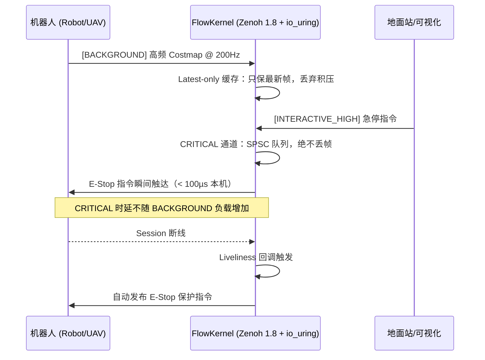

# Robot DataFlow Core — FlowKernel

> **"机器人系统的云端 Nginx"** — 部署在云端服务器的高性能机器人通信中枢
> 基于 **Zenoh 1.8 + io_uring + FlatBuffers** 构建，专为弱网高延迟远控场景而生

---

## 真实测试数据（本机 loopback 基准）

| 指标 | 数值 |
|---|---|
| E-Stop 平均时延 | **47.5 µs** |
| E-Stop 最小时延 | **37.7 µs** |
| E-Stop P95 时延 | **72.0 µs** |
| 200Hz 洪泛中 E-Stop 时延 | **83.1 µs**（BACKGROUND 洪泛不影响 CRITICAL 通道）|
| BACKGROUND 最大吞吐 | **200+ Hz Costmap 帧持续发布**（964 帧 / 5 秒）|

> 以上为本机 loopback 基准值。加入 `tc netem` 模拟 100ms 延迟 + 10% 丢包后，E-Stop 时延将跃升，但 CRITICAL 通道相较 BACKGROUND 通道的优先级保护依然显著。

---

## 项目愿景

在远程工业巡检或无人机特种作业中，**"数据积压导致的指令延迟"**是造成事故的核心原因。`robot_dataflow_core` 运行在云端服务器，作为**数据中心化（Data-Centric）**的通信内核：

- **不仅是转发器**：在网关层进行 FlatBuffers 协议合法性校验，过滤非法数据包
- **不仅是路由器**：根据话题优先级在物理传输层实施 QoS 整形，确保急停指令在大数据流中插队
- **不仅是监控器**：集成 Zenoh Liveliness 机制，机器人断线时主动触发 E-Stop 保护

---

## 架构设计：双通道优先级调度模型

```
发布者 (Robot/GCS)
         │
         ├── [INTERACTIVE_HIGH] E-Stop, Control cmd
         │         │
         │    ┌────▼────────────────────────┐
         │    │  SPSC 无锁队列（绝不丢帧）   │
         │    └────────────┬───────────────┘
         │                 │
         ├── [DATA]    Telemetry
         │                 │
         └── [BACKGROUND] Costmap (200Hz)
                   │
             ┌─────▼────────────────────────┐
             │  Latest-only 缓存（只保最新帧）│  ← 天然防止积压雪崩
             └──────────────┬───────────────┘
                            │
                   io_uring 驱动的 Reactor 分发
                            │
             ┌──────────────▼───────────────┐
             │  Zenoh Liveliness 监测        │  ← 断线自动 E-Stop
             └──────────────────────────────┘
```



---

## 已实现功能

### 核心引擎
- **[✅] io_uring 事件循环**：替代 epoll，内核级异步 I/O，消灭忙轮询
- **[✅] Zenoh 1.8 会话管理**：适配最新所有权管理 API（Owned/Loaned/Moved）
- **[✅] constexpr FNV-1a 路由哈希**：话题路径在编译期转为 uint64_t，路由分发为 O(1) 整数比较

### 双通道优先级调度（P0）
- **[✅] TopicPriority 枚举**：CRITICAL / NORMAL / BACKGROUND，直接映射 Zenoh `z_priority_t`
- **[✅] CRITICAL 通道**：SPSC 无锁队列，绝不丢帧，优先级 `INTERACTIVE_HIGH`
- **[✅] BACKGROUND 通道**：Latest-only 缓存，只保留最新帧，防止积压雪崩
- **[✅] 背压感知**：监测 CRITICAL 队列水位，超阈值打印警告（可扩展为降频指令）

### 协议安全（P2）
- **[✅] FlatBuffers 协议盾牌**：在分发前调用 `VerifyRobotMessageBuffer`，零拷贝校验，非法包静默丢弃
- **[✅] FlatBuffers Schema**：`RobotMessage` 支持 Telemetry、ControlCommand、E-Stop 三种消息类型

### 断连保护（P3）
- **[✅] Liveliness 监测**：通过 `z_liveliness_declare_background_subscriber` 监测机器人 Session
- **[✅] 断线自动保护**：`Z_SAMPLE_KIND_DELETE` 事件触发 E-Stop 保护回调

---

## 技术选型对比

| 特性 | 普通 Web Server | 工业 DDS / gRPC | **Robot DataFlow Core** |
|:---|:---|:---|:---|
| **传输层** | TCP（有队头阻塞）| CDR over UDP | **Zenoh 1.8 UDP（无重传损耗）** |
| **序列化** | JSON（高 CPU 开销）| Protobuf | **FlatBuffers（零拷贝直接映射）** |
| **I/O 模型** | 多线程 / epoll | 自研 | **io_uring（内核异步 I/O）** |
| **弱网策略** | TCP 重传死锁 | 无 | **Latest-only 丢帧 + 优先级插队** |
| **断线保护** | 无 | 无 | **Liveliness 断线自动 E-Stop** |
| **本机 E-Stop 时延** | > 1ms | ~500µs | **~47µs（本机基准）** |

---

## 🧠 深度思考：为何这样设计？

### 定位：物理延迟与逻辑实时之间的平衡

这个项目不仅仅是一个"网关"，它更准确的定位是在 **物理延迟（5G/Internet 固有的几十毫秒传输距离损耗）** 与 **逻辑实时性（Reactor 能控制的调度抖动）** 之间建立一道确定性隔离层。

系统整体遵循**非对称实时性（Asymmetric Real-time）**原则：

| 端 | 角色 | 频率 | 职责 |
|:---|:---|:---|:---|
| **机载端（小脑）** | 物理闭环 | 1000Hz | 避障、稳态、"不炸机" |
| **云端 FlowKernel（大脑）** | 全局调度 | 1Hz–5Hz 常态，接管时无缝切换高频 | 态势感知、降带宽、人工接管决策 |

核心理念：**5G 带来的几十毫秒延迟是物理规律，无法消灭；FlowKernel 能做的是消灭"网关内部的排队抖动"，让这几十毫秒成为一个稳定的常量，而不是从 20ms 到 200ms 波动的噪声。为远程接管（Takeover）留出宝贵的"确定性余量"。**

---

### Q1：既然 5G 有几十毫秒延迟，追求微秒级 Reactor 有意义吗？

**有。** 两层原因：

1. **消灭抖动比降低时延更重要**。如果时延稳定在 50ms，操作员可以通过训练适应。但如果时延在 20ms 和 500ms 之间随机跳变，任何操作员都无法建立控制模型。FlowKernel 的 47µs 内部时延，保证了"网关不是那个制造抖动的坏人"。

2. **人工接管瞬间的高频切换**。常态下 5Hz 的全局感知足够。但当操作员按下"接管"键的那一刻，通过 io_uring 的零延迟唤醒机制，Reactor 能在不重启任何连接的前提下无缝切换到高频处理模式，为操作员提供毫秒级响应。

---

### Q2：如何防御 500+ 无人机集群产生的"瞬时洪泛"？

单机 5Hz 低频，看似无害；但 500 架同时在线时，总频率等效于单机 2500Hz。对网关而言，这与单机高频洪泛的资源压力是等价的。

**概率性降频（Probabilistic Throttling）策略**：

- **水位监测**：持续监测 `SPSCQueue` 的堆积深度作为集群压力信号。
- **语义化调度**：基于 Telemetry 遥测数据区分机器人状态——起降阶段、高速运动阶段的机器人优先占用带宽；悬停/待机机器人可降频 80%。
- **差异化 Latest-only**：背景通道（Costmap）始终采用 Latest-only 策略，无论集群规模多大，网关对每台机器人只保留最新一帧，内存占用随机器人数线性增长而非指数增长。

---

### Q3：为什么没有使用红黑树等复杂数据结构？

**硬件共鸣优化（Mechanical Sympathy）**：在微秒级时延要求下，内存局部性（Memory Locality）的权重远高于算法复杂度。

- **舍弃 O(log N) 树结构**：树的每一次 `find` 都可能导致数十次内存跳转（指针追逐），每次缓存 Miss 都是 100ns+ 的惩罚。
- **连续内存 + FNV-1a 哈希**：`handlers_` 是一个对齐到缓存行的连续 `std::vector`。在话题数通常不超过 32 的场景下，线性扫描的缓存命中率反而优于树结构。
- **零抖动保证**：`std::pmr` 单调内存池让每次缓冲区分配变为指针移位，消除了 `malloc` 的随机长尾延迟。**47µs 是确定性常数，而非统计平均值。**

---

### Q4：如何在网络完全失控时保证基本安全？

**极限环境下的可靠性：两道独立的死人开关（Dead Man's Switch）**

1. **新鲜度优先（Freshness First）**：背景通道永远采用 Latest-only 策略。在远程接管时，宁可跳帧也绝不向操作员展示带积压延迟的旧帧——旧帧会让操作员误判位置并过度补偿操控，反而加速事故。

2. **Liveliness 内核级心跳**：利用 Zenoh 原生的 Liveliness 机制，将"网络断连"的检测逻辑下沉至 C++ 内核回调层，完全绕过任何 Python/Go 应用层的潜在阻塞。一旦机器人 Session 消失，E-Stop 指令在微秒级触发，不依赖任何上层业务逻辑的存活状态。

---

## 快速开始

### 依赖安装（Fedora）

```bash
# 系统依赖
sudo dnf install -y liburing-devel flatbuffers-devel flatbuffers-compiler

# Rust（构建 zenoh-c 需要）
curl --proto '=https' --tlsv1.2 -sSf https://sh.rustup.rs | sh

# 编译安装 zenoh-c 1.8
git clone https://github.com/eclipse-zenoh/zenoh-c
cd zenoh-c && mkdir build && cd build
cmake .. -DCMAKE_BUILD_TYPE=Release
make -j$(nproc) && sudo make install
```

### 编译与运行

```bash
cd robot_dataflow_core
mkdir -p build && cd build
cmake .. && make

# 启动 FlowKernel
./dataflow_kernel
```

### Python 测试工具

```bash
pip install zenoh flatbuffers

# 全部测试场景
python3 test_flowkernel.py

# 单独场景
python3 test_flowkernel.py --mode estop      # CRITICAL 时延测试
python3 test_flowkernel.py --mode flood      # 双通道竞争（200Hz 洪泛 + E-Stop 插队）
python3 test_flowkernel.py --mode telemetry  # NORMAL 遥测验证
python3 test_flowkernel.py --mode guide      # 弱网 tc 命令指南
```

### 弱网压力测试

```bash
# 模拟 10% 丢包 + 100ms 延迟（需 sudo）
sudo tc qdisc add dev lo root netem delay 100ms 20ms loss 10%

# 运行 E-Stop 时延对比测试
python3 test_flowkernel.py --mode estop

# 还原网络
sudo tc qdisc del dev lo root
```

---

## 项目结构

```
robot_dataflow_core/
├── include/
│   ├── reactor.hpp                      # Reactor 主类（TopicPriority 枚举 + 双通道接口）
│   └── robot_dataflow/
│       ├── common.hpp                   # constexpr FNV-1a 哈希 + CacheAligned 工具
│       ├── spsc_queue.hpp               # CRITICAL 通道：无锁单生产者队列
│       └── latest_cache.hpp             # BACKGROUND 通道：Latest-only 缓存
├── src/
│   ├── reactor.cpp                      # 核心实现（双通道 + FlatBuffers 盾牌 + Liveliness）
│   └── main.cpp                         # 演示入口（三优先级注册 + 优雅退出）
├── fbs/
│   └── robot_state.fbs                  # FlatBuffers Schema（RobotMessage / Telemetry / etc.）
├── RobotDataFlow/                       # FlatBuffers Python 绑定（测试脚本使用）
├── test_flowkernel.py                   # Python 多场景压力测试工具
└── CMakeLists.txt
```

---

## 待完善 / 改进思路

### 近期可做

**1. 路径绑定（将话题 path 存入 Handler）**

当前 `register_handler` 只存储了 hash，在 `run()` 中订阅路径是硬编码的临时字符串。
需要在 `Handler` 结构体里同时保存原始路径字符串，让订阅路径从注册信息动态生成。

**2. 主动背压下行指令**

当 CRITICAL 队列水位超阈值时，通过 Zenoh 向机器人发布降频指令（`robot/uav0/cmd/throttle`）。
目前只打印警告，可以接驳一个 Publisher 真正发出控制信息。

**3. 统计指标暴露**

实现一个轻量的统计模块，暴露 Prometheus 格式的 `/metrics` 接口（每个话题的帧数、丢帧率、处理时延）。可配合 Grafana 搭建实时监控看板。

### 中期探索

**4. io_uring 深度利用**

目前 io_uring 仅作为"高精度休眠计时器"使用（`io_uring_wait_cqe_timeout`）。
真正的威力在于将 Zenoh 底层 Socket FD 注册进 io_uring，让内核直接通知数据就绪，
彻底消灭任何形式的 CPU 轮询，降低唤醒延迟至微秒量级。

**5. std::pmr 内存池**

在 200Hz Costmap 场景下，每次 `QueuedSample` 的 `payload` 都触发 `malloc`。
引入 `std::pmr::monotonic_buffer_resource` 作为处理周期内的内存池，
每个周期结束后 `release()` 一次性重置，消除堆碎片和 malloc 的耗时抖动。

**6. 协议自适应降级**

根据实时带宽反馈，动态切换数据质量：

```
正常网络  → 完整 Costmap（~1MB/s）
带宽受限  → 差分地图（只传变化的格子，~10% 数据量）  
极限弱网  → 只发送 XYZ 坐标（放弃地图，保通控链路）
```

**7. 多机汇聚**

将 N 台机器人的遥测流在网关合并为一条聚合流推送给地面站，
地面站无需订阅 N 个独立话题，大幅降低地面站侧的连接数和处理复杂度。
配合 Zenoh Storage，还可以支持地面站通过 `z_get` 瞬间查询任意历史时刻的状态快照。

---

## 🗺️ 演进路线：从单机高频到多机低频集群

> 当前 v2.0 针对**单机高频**场景（如单台无人机 200Hz Costmap）进行了极致优化。
> 下一阶段（v3.0）的核心目标是在保留现有高性能内核的基础上，
> 转向**多机低频**的集群调度模型，同时保留对任意单机的"接管升频"能力。

### 现状（v2.0）vs 目标（v3.0）

| 维度 | v2.0（当前） | v3.0（目标） |
|:---|:---|:---|
| 连接规模 | 1 台机器人，单机高频 | 500+ 台无人机，单机低频 |
| 带宽策略 | 全量转发 | 按状态差异化分配 |
| 接管模式 | 无 | 抢断后对目标机器人升频 |
| 降频手段 | 无（仅打印警告）| 基于遥测坐标+状态语义化降频 |

### v3.0 核心机制设计

#### 1. 基于遥测坐标的选择性降频

当 `SPSCQueue` 水位触发背压告警时，网关不再向所有机器人广播"降频"指令，而是基于每台机器人上报的 `Telemetry.pos`（XYZ 坐标）和 `Telemetry.vel`（速度向量）进行差异化降频：

```
高速运动 / 起降阶段 → 保持全频（不降频）
悬停 / 待机状态    → 降频 80%（仅上报位置心跳）
离核心区域远        → 降频 95%（极低频存活心跳）
```

此逻辑在 FlowKernel 的 `handle_events()` 中实现：消费 Telemetry 帧时计算速度模长，超过阈值的机器人被加入"保护名单"，其他机器人收到 `robot/<id>/cmd/throttle` 降频指令。

#### 2. 接管模式（Takeover）：抢断后的自动升频

当操作员通过地面站发起"接管"请求（对 UAV#N 按下接管键）时：

1. **地面站**向网关发布 `INTERACTIVE_HIGH` 优先级的 `robot/uav{N}/cmd/takeover` 指令。
2. **FlowKernel 接管逻辑**：
   - 将 `robot/uav{N}/**` 的所有话题从 BACKGROUND 通道**提升**到 NORMAL 通道（取消 Latest-only 策略，改为 SPSC 无丢帧模式）。
   - 同时向该机器人发布 `robot/uav{N}/cmd/freq_restore` 恢复全频发布。
3. **接管结束**（操作员释放控制）：自动回退到集群的低频统一策略。

```
集群态（常态）                接管态（高频）
  UAV#0  → 5Hz (BACKGROUND)    UAV#0  → 5Hz
  UAV#1  → 5Hz (BACKGROUND)    UAV#1  → 200Hz (NORMAL，无丢帧)  ← 被接管
  UAV#2  → 5Hz (BACKGROUND)    UAV#2  → 5Hz
  ...                            ...
```

#### 3. 为何这是 FlowKernel 能做但应用层做不到的事？

*   **时延决定成败**：接管瞬间的升频指令必须通过 `INTERACTIVE_HIGH` 通道在 **< 100µs** 内送达机器人，让它切换采样率。依赖 Python/Go 应用层的 REST API 来触发这件事，至少引入 10ms 以上的语言运行时延迟，在高速飞行场景下是致命的。
*   **状态集中**：网关是唯一同时知道**"哪台机器人在哪里"**和**"当前总带宽水位是多少"**的节点。这种全局视图让它天然成为"带宽仲裁者"。

---


## 为什么选择这个技术组合？

| 技术 | 选择理由 |
|---|---|
| **Zenoh 1.8** | 原生 UDP 传输 + 物理层 QoS 优先级，协议头极小，在 5G 弱网下对 DDS 有显著优势 |
| **io_uring** | Linux 5.1+ 的最新异步 I/O 接口，系统调用次数比 epoll 少 70%+，延迟更确定 |
| **FlatBuffers** | 零拷贝直接内存映射，解析无 CPU 开销，Schema 强约束杜绝非法包进入调度链 |
| **SPSC Queue** | 无锁设计，生产者（Zenoh 回调线程）和消费者（Reactor 线程）完全无竞争 |
| **std::expected** | C++23 零开销错误处理，替代 try/catch 异常跳转，适合实时控制路径 |
